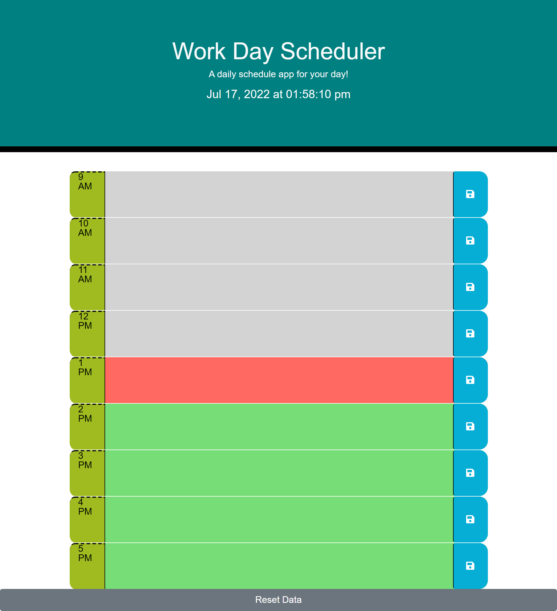

# 05 Work Day Scheduler

In this assignment, I was tasked to create a functional work day scheduler that I can insert projects that would save to local storage and persist afer a refresh. This assignment uses HTML/CSS/JavaScript/Moment()/Jquery/ and Bootstrap. The scheduler takes in the current time and displays the time blocks based off the current time. Past time block will be grey. Present time box will be red and future time blocks will be green. 

## User Story

AS AN employee with a busy schedule

I WANT to add important events to a daily planner

SO THAT I can manage my time effectively

## Acceptance Criteria

GIVEN I am using a daily planner to create a schedule

WHEN I open the planner

THEN the current day is displayed at the top of the calendar

WHEN I scroll down

THEN I am presented with timeblocks for standard business hours

WHEN I view the timeblocks for that day

THEN each timeblock is color coded to indicate whether it is in the past, present, or future

WHEN I click into a timeblock

THEN I can enter an event

WHEN I click the save button for that timeblock

THEN the text for that event is saved in local storage

WHEN I refresh the page

THEN the saved events persist

## Work Completed

*Creates columns

*Changes columns classes to represent what time it is

*Sets and gets content written in text area in local storage

*Adds a gitignore

*Creates a date with moment()

*Uses setInterval() to make date and time increase

*Adds reset button to remove content

## Deployed Site

The deployed site hosted by GitHub.
https://scottwatt.github.io/WorkDayScheduler/

## Screenshot

### Full page

### Text

